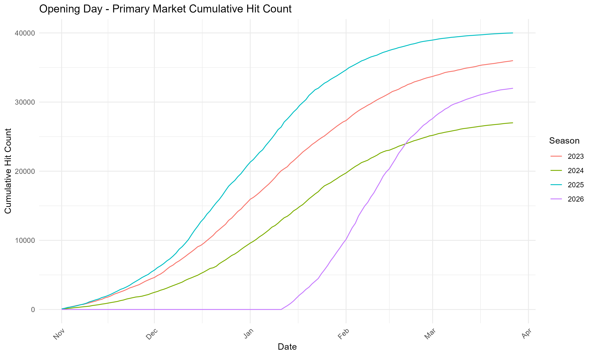
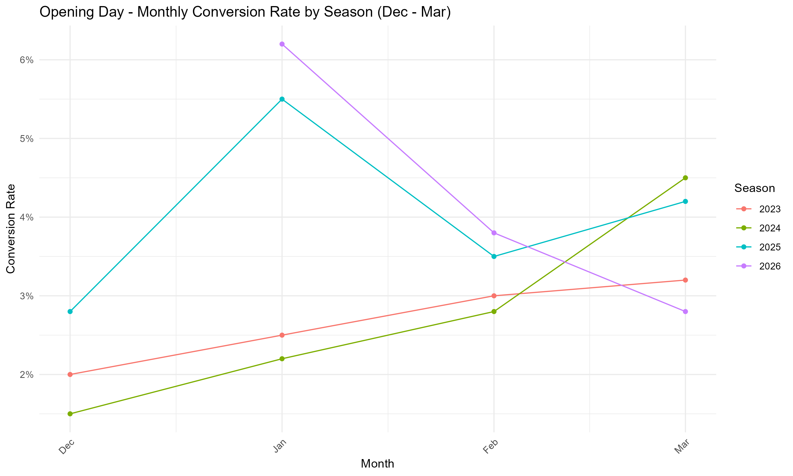
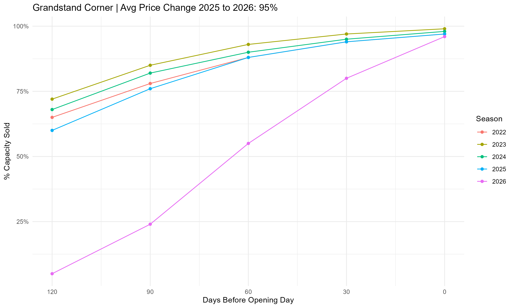
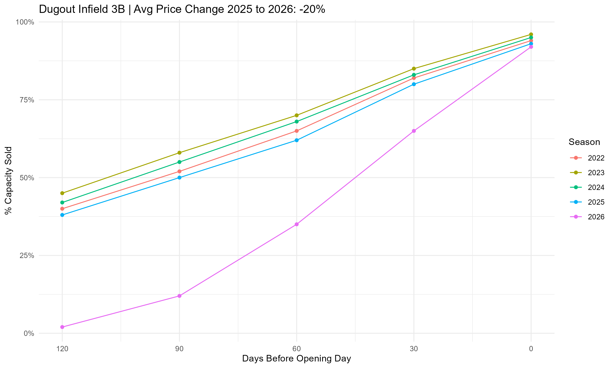
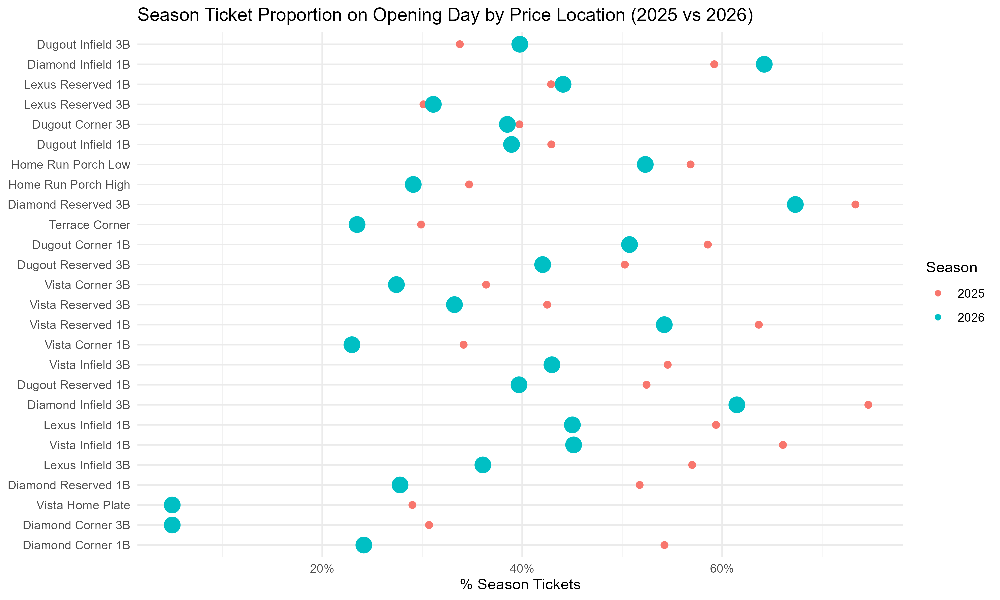
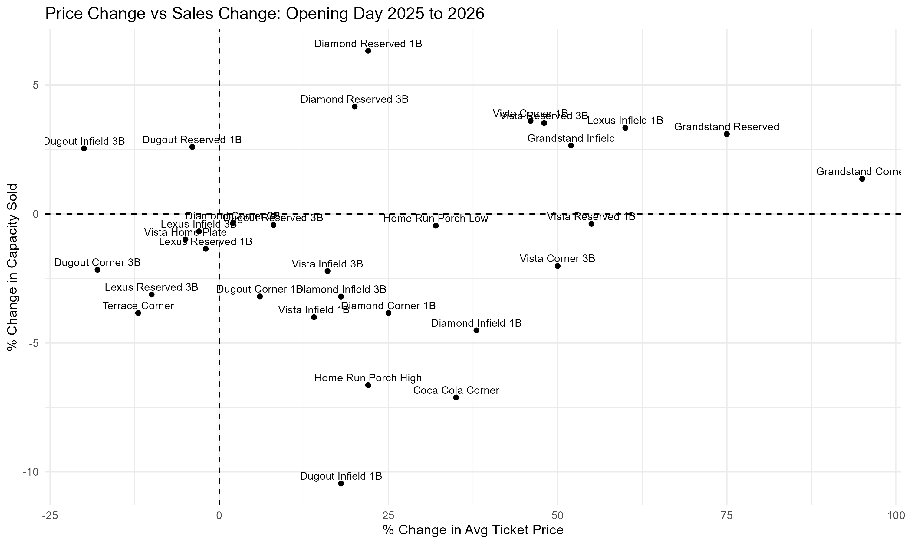
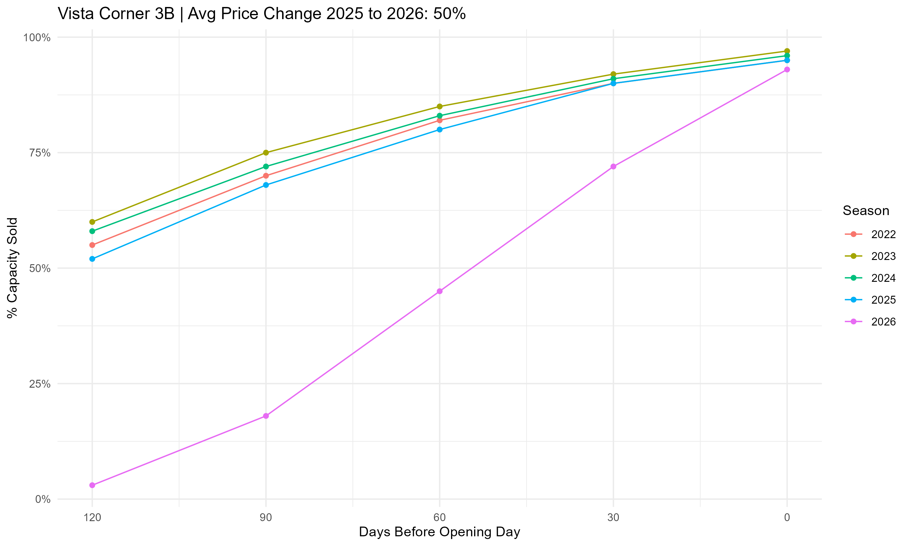
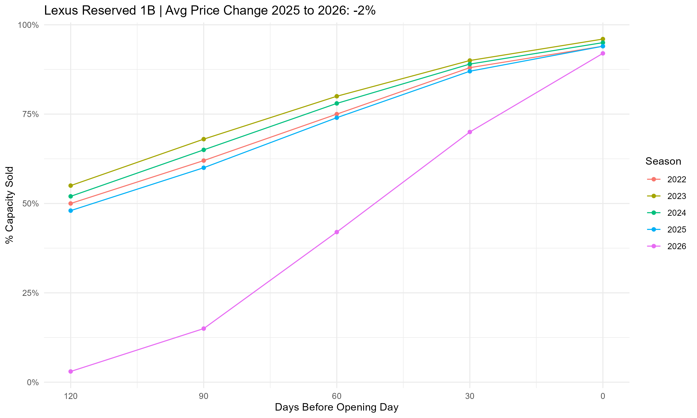
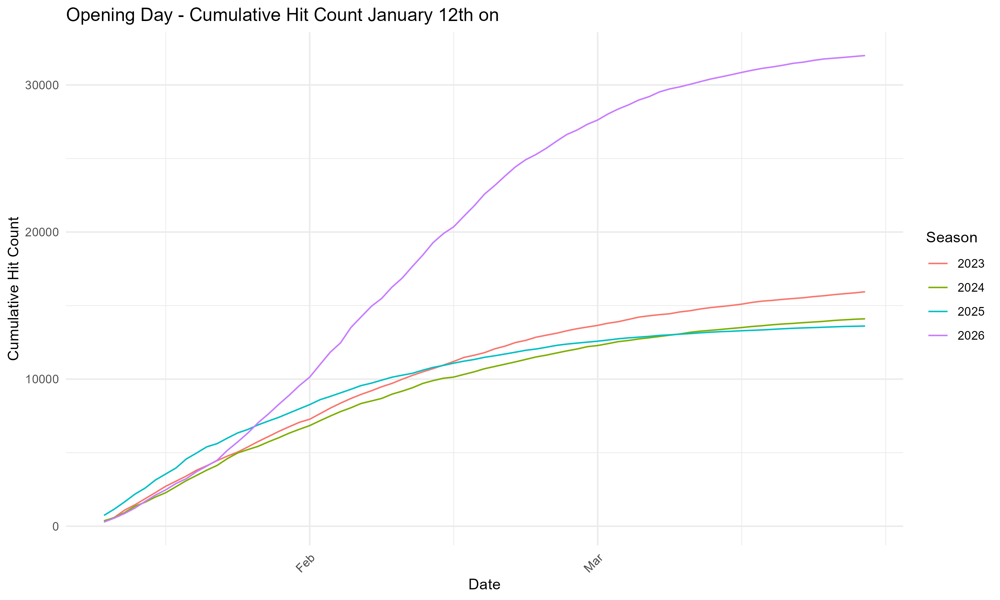
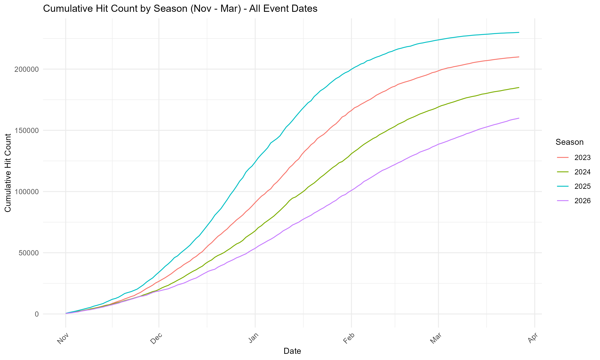

```{r setup, include=FALSE}
knitr::opts_chunk$set(fig.pos = "H")
library(dplyr)
library(knitr)
library(kableExtra)
library(scales)

ticket_group_table     <- read.csv("data/ticket_group_table.csv")
price_change_table     <- read.csv("data/price_change.csv")
avg_price_table        <- read.csv("data/avg_price_overall.csv")
season_ticket_avg_price <- read.csv("data/season_ticket_avg_price.csv")
season_ticket_overall  <- read.csv("data/season_ticket_overall.csv")
avg_price_by_month     <- read.csv("data/avg_price_by_month.csv")

# Helper for formatting currency in LaTeX text
ldollar <- function(x) {
  paste0("\\$", formatC(x, format = "f", digits = 0, big.mark = ","))
}

# Pre-compute key metrics for inline use
total <- ticket_group_table %>% filter(ticket_group == "Total")
st    <- ticket_group_table %>% filter(ticket_group == "Season Tickets")
sp    <- ticket_group_table %>% filter(ticket_group == "Single Primary")
ss    <- ticket_group_table %>% filter(ticket_group == "Single Secondary")
gr    <- ticket_group_table %>% filter(ticket_group == "Group")

price_25  <- avg_price_table$avg_price_per_seat[avg_price_table$season == "2025"]
price_26  <- avg_price_table$avg_price_per_seat[avg_price_table$season == "2026"]
price_chg <- round((price_26 - price_25) / price_25 * 100, 1)
```

*Note: This report uses synthetically generated data for portfolio purposes. The analytical framework and methodology reflect a real project.*

\newpage

# Executive Summary

This report provides an overview of how Opening Day ticket sales changed following strategic pricing adjustments, and what the resulting impacts were compared to the prior season. The analysis covers ticket class distribution, average pricing trends, site traffic, sales pacing, and season ticket proportions across price locations.

Total primary market revenue for Opening Day increased from `r ldollar(total$revenue_2025)` to `r ldollar(total$revenue_2026)` (`r total$revenue_chg_pct`% increase). The total number of tickets sold decreased from `r format(total$seats_2025, big.mark = ",")` to `r format(total$seats_2026, big.mark = ",")`.


**What We Did Differently**

- **Season ticket volume was reduced intentionally.** Decreased `r format(abs(st$seats_2025 - st$seats_2026), big.mark = ",")` from `r format(st$seats_2025, big.mark = ",")` to `r format(st$seats_2026, big.mark = ",")` (`r abs(st$seats_chg_pct)`% decrease)(\hyperref[ticket_class_distribution]{see Ticket Class Distribution}).
- **Single game prices were increased significantly.** Average single game price increased from `r ldollar(price_25)` to `r ldollar(price_26)` (`r price_chg`% increase)(\hyperref[average_pricing_opening_day]{see Average Pricing Opening Day}).
- **Group discount was eliminated.**

**What Happened**

- **Higher prices drove significant revenue growth despite lower volume.** Season ticket revenue increased by `r ldollar(st$revenue_2026 - st$revenue_2025)` (`r st$revenue_chg_pct`%), single primary revenue increased by `r ldollar(sp$revenue_2026 - sp$revenue_2025)` (`r sp$revenue_chg_pct`%), and single secondary revenue increased by `r ldollar(ss$revenue_2026 - ss$revenue_2025)` (`r ss$revenue_chg_pct`%)(\hyperref[ticket_class_distribution]{see Ticket Class Distribution}).
- **Single secondary tickets rose while Group tickets declined.** Single secondary tickets increased from `r format(ss$seats_2025, big.mark = ",")` to `r format(ss$seats_2026, big.mark = ",")` (`r ss$seats_chg_pct`% increase) and Group tickets decreased from `r format(gr$seats_2025, big.mark = ",")` to `r format(gr$seats_2026, big.mark = ",")` (`r abs(gr$seats_chg_pct)`% decrease)(\hyperref[ticket_class_distribution]{see Ticket Class Distribution}).
- **Opening Day site traffic tracked well following the January 12th on-sale date**, though overall site traffic across all games trailed prior years(\hyperref[full_season_hits]{see Figure \ref*{fig:fig-full_season_hits}}).
- **Sales paced later but held strong**, with most price locations achieving similar sell-through rates to prior years by Opening Day(\hyperref[sales-pacing]{see Change in Sales Pacing}).

\newpage

# Ticket Class Distribution (Including Premium and Non-Premium): 2025 vs 2026
\label{ticket_class_distribution}
```{r, echo=FALSE, message=FALSE, warning=FALSE}
ticket_group_table %>%
  mutate(
    seats_chg_pct = paste0(seats_chg_pct, "%"),
    revenue_2025 = dollar(revenue_2025),
    revenue_2026 = dollar(revenue_2026),
    revenue_chg_pct = paste0(revenue_chg_pct, "%")
  ) %>%
  kbl(booktabs = TRUE, linesep = "",
      col.names = c("Ticket Class", "Seats 2025", "Seats 2026",
                     "Seats % Change", "2025 Revenue", "2026 Revenue",
                     "Revenue % Change")) %>%
  kable_styling(latex_options = c("hold_position", "scale_down"),
                font_size = 11)
```

The number of Opening Day tickets attributed to Season Tickets decreased by `r format(abs(st$seats_2025 - st$seats_2026), big.mark = ",")` tickets (`r abs(st$seats_chg_pct)`% decrease) but there has been a `r st$revenue_chg_pct`% increase in revenue. Group tickets decreased by `r format(abs(gr$seats_2025 - gr$seats_2026), big.mark = ",")` (`r abs(gr$seats_chg_pct)`% decrease) with a `r abs(gr$revenue_chg_pct)`% decrease in revenue. Single game secondary tickets increased by `r format(ss$seats_2026 - ss$seats_2025, big.mark = ",")` (`r ss$seats_chg_pct`% increase) with a `r ss$revenue_chg_pct`% increase in revenue. Single game primary tickets decreased by `r format(abs(sp$seats_2025 - sp$seats_2026), big.mark = ",")` (`r abs(sp$seats_chg_pct)`% decrease) but with a `r sp$revenue_chg_pct`% increase in revenue.


# Site Traffic - Opening Day Hits
\label{opening_day_hits}
```{r fig-opening_day_hits, echo = FALSE, out.width = "80%", fig.align = "center", fig.cap = "Opening Day Hits"}

```

Opening Day sales for this season did not open until January 12th. Despite the later on-sale date, site traffic tracked reasonably well compared to prior seasons leading up to Opening Day.


# Average Pricing Opening Day Single Game Tickets by Year (Non-Premium Only)
\label{average_pricing_opening_day}
```{r, echo=FALSE, message=FALSE, warning=FALSE}
avg_price_table %>%
  mutate(avg_price_per_seat = dollar(avg_price_per_seat)) %>%
  kbl(booktabs = TRUE,
      col.names = c("Season", "Average Seat Price",
                     "Number of Seats Sold")) %>%
  kable_styling(latex_options = c("hold_position"), font_size = 11)
```

Since last season, the average ticket price on Opening Day for a single game ticket went up by `r ldollar(price_26 - price_25)` (`r price_chg`% increase). The number of seats sold went down by `r format(abs(avg_price_table$total_seats[avg_price_table$season == "2026"] - avg_price_table$total_seats[avg_price_table$season == "2025"]), big.mark = ",")`.

\newpage


# Primary Market Conversion Rates for Opening Day
```{r fig-opening_day_conv, echo = FALSE, out.width = "75%", fig.align = "center", fig.cap = "Opening Day Conversion Rates"}

```

This graph shows the conversion rates (number of unique buyers / number of visitors) for the Opening Day ticket page over the last 4 years. The prior season saw an increase in conversion rate from December to January as average prices decreased. This year, the conversion rate was high in January when ticket prices were also high, then dropped as ticket inventory decreased.


# Change in Sales Pacing
\label{sales-pacing}

## Grandstand Corner

```{r fig-grandstand_corner_pacing, echo = FALSE, out.width = "80%", fig.align = "center", fig.cap = "Grandstand Corner Sales Pacing"}

```

Single-game tickets for Opening Day in the Grandstand Corner were virtually sold out months ahead of time in years past. This year, tickets sold slower but still steadily over the months leading up to Opening Day.


## Dugout Infield 3B

```{r fig-dugout_infield_3b_pacing, echo = FALSE, out.width = "80%", fig.align = "center", fig.cap = "Dugout Infield 3B Sales Pacing"}

```

Dugout Infield 3B tickets sold significantly in the last 30 days before Opening Day and were still able to essentially sell out.


# Proportion of Season Tickets by Price Location: 2025 vs. 2026
\label{season_ticket_prop}
```{r fig-season_ticket_prop, echo = FALSE, out.width = "75%", fig.align = "center", fig.cap = "Season Ticket Proportions"}

```

This visual shows the proportion of tickets in each price location family that are season tickets. Nearly every price location family has seen a decrease in season ticket share. A small number of premium locations saw a slight increase.


\newpage

# Average Pricing by Price Location: 2025 vs. 2026 Single Game and Season Tickets (Non-Premium Only)

```{r, include = FALSE}
price_change_combined <- price_change_table %>%
  rename(
    single_avg_2025 = avg_price_per_seat_2025,
    single_avg_2026 = avg_price_per_seat_2026,
    single_chg_pct = price_chg_pct
  ) %>%
  left_join(
    season_ticket_avg_price %>%
      rename(
        season_avg_2025 = `X2025`,
        season_avg_2026 = `X2026`,
        season_chg_pct = price_chg_pct
      ),
    by = "DA.Price.Location.Name"
  ) %>%
  arrange(-single_chg_pct)

total_row <- tibble(
  DA.Price.Location.Name = "Total",
  single_avg_2025 = avg_price_table$avg_price_per_seat[
    avg_price_table$season == "2025"],
  single_avg_2026 = avg_price_table$avg_price_per_seat[
    avg_price_table$season == "2026"],
  single_chg_pct = round(
    (single_avg_2026 - single_avg_2025) / single_avg_2025 * 100, 2),
  season_avg_2025 = season_ticket_overall$avg_price_per_seat[
    season_ticket_overall$year == "2025"],
  season_avg_2026 = season_ticket_overall$avg_price_per_seat[
    season_ticket_overall$year == "2026"],
  season_chg_pct = round(
    (season_avg_2026 - season_avg_2025) / season_avg_2025 * 100, 2)
)

price_change_combined <- bind_rows(price_change_combined, total_row)
```


```{r, echo=FALSE, message=FALSE, warning=FALSE}
price_change_combined %>%
  mutate(
    single_avg_2025 = dollar(single_avg_2025),
    single_avg_2026 = dollar(single_avg_2026),
    single_chg_pct = paste0(single_chg_pct, "%"),
    season_avg_2025 = dollar(season_avg_2025),
    season_avg_2026 = dollar(season_avg_2026),
    season_chg_pct = paste0(season_chg_pct, "%")
  ) %>%
  kbl(booktabs = TRUE, linesep = "",
      col.names = c("Price Location Name",
                     "Single Game 2025", "Single Game 2026",
                     "Single Price Change %",
                     "Season Average 2025", "Season Average 2026",
                     "Season Price Change %")) %>%
  kable_styling(latex_options = c("hold_position", "scale_down"),
                font_size = 9)
```


The majority of price location families saw noticeable jumps in their average ticket prices on single game transactions for Opening Day. The largest increases in single game prices came from the lower-priced, high-demand sections. A small number of premium sections saw modest decreases. Nearly all price locations also saw significant increases in the season ticket value attributed to Opening Day.

# Price Change vs. Sales Change Opening Day: 2025 to 2026

```{r fig-price_vs_sales, echo = FALSE, out.width = "80%", fig.align = "center", fig.cap = "Price vs. Sales Change Opening Day"}

```

Despite significant price increases across most sections, the majority of price location families sold approximately the same number of Opening Day single game tickets compared to last year. Several sections sold more tickets even with higher prices, suggesting strong demand elasticity for premium events.

# Appendix {-}

## Vista Corner 3B

```{r fig-vista_corner_3b_pacing, echo = FALSE, out.width = "80%", fig.align = "center", fig.cap = "Vista Corner 3B Sales Pacing"}

```

Tickets for Vista Corner 3B sold later than years past but were still able to sell steadily and nearly sell out.

## Lexus Reserved 1B

```{r fig-lexus_reserved_1b_pacing, echo = FALSE, out.width = "80%", fig.align = "center", fig.cap = "Lexus Reserved 1B Sales Pacing"}

```

As with other price location families, Lexus Reserved 1B tickets sold later than the past few years but still sold nearly the same percentage of capacity.


## Site Traffic - Opening Day Hits post January 12th

```{r fig-opening_day_hits_postjan12, echo = FALSE, out.width = "80%", fig.align = "center", fig.cap = "Opening Day Hits post January 12th"}

```

This visual shows the site traffic from January 12th forward. January 12th was the day Opening Day tickets went on sale. This graph does not include the hits accumulated on the first days of sales for the prior seasons.


## Site Traffic - Full Season Hits
\label{full_season_hits}
```{r fig-full_season_hits, echo = FALSE, out.width = "80%", fig.align = "center", fig.cap = "Full Season Hits"}

```

This graph displays the total hits accumulated for all games each season from November to March. The site traffic for the current season is generally behind that of prior seasons.
